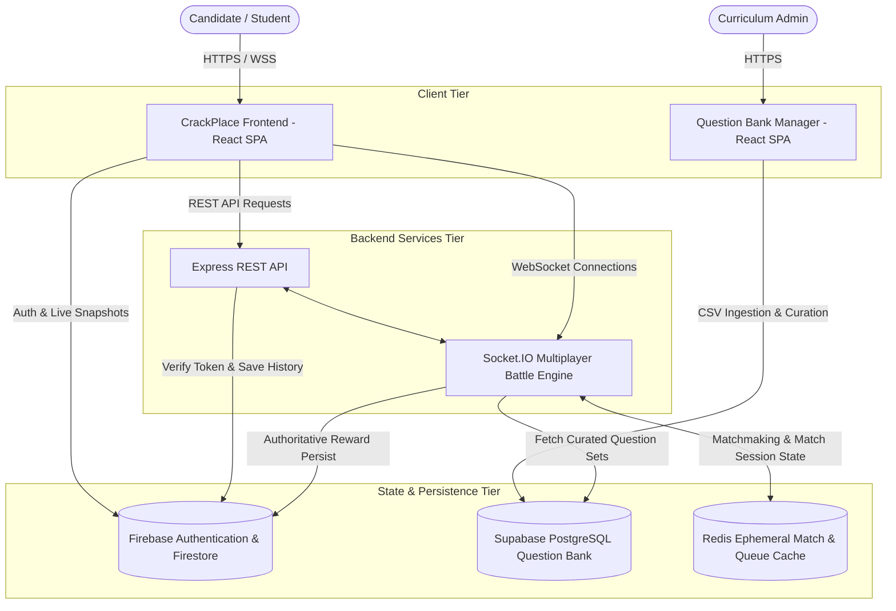

# CrackPlace AI — System Architecture & Data Flow

This document details the architectural design, communication boundaries, and state lifecycle across the CrackPlace AI ecosystem.

---

## 🏗️ High-Level System Architecture



---

## 🔄 Core Data Flows

### 1. 1v1 Battle Arena Matchmaking & Live Combat

```
Player A (Queues)  ───►  /matchmaking Namespace  ───►  Pushes Ticket to Redis List
Player B (Queues)  ───►  /matchmaking Namespace  ───►  Atomic Match Detected
                                                               │
                                                               ▼
QuestionService (Supabase / Cache)  ◄───  Selects 5 Questions for DSA/Medium
                                                               │
        ┌──────────────────────────────────────────────────────┴──────────────────────────────────────────────────────┐
        ▼                                                                                                             ▼
Player A Package                                                                                             Player B Package
• Shuffled Option Map (A->C, B->A, C->D, D->B)                                                              • Shuffled Option Map (A->B, B->D, C->A, D->C)
• Stripped Answers & Explanations                                                                            • Stripped Answers & Explanations
        │                                                                                                             │
        └──────────────────────────────────────────────────────┬──────────────────────────────────────────────────────┘
                                                               ▼
                                                  Live Game Room (/battle)
                                    Answers Submitted As Relative Coordinates (0, 1, 2, 3)
                                                               │
                                                               ▼
                                             Server Maps Relative -> Authoritative DB Index
                                             Calculates Response Time & Scores Instant Points
                                                               │
                                                               ▼
                                                      All Questions Finished
                                                               │
                                                               ▼
                                             BattleResultProcessor (Idempotent Transaction)
                                             • Calculates Symmetrical Elo
                                             • Calculates Total XP & Level Ups
                                             • Calculates Coins Earned
                                             • Writes battleHistory, users, xpTransactions
```

---

## 💾 State Storage Strategy

| Component | Storage Layer | Lifecycle | Access Pattern |
| :--- | :--- | :--- | :--- |
| **User Identity & Token** | Firebase Auth | Persistent (JWT) | Bearer Token in HTTP / Socket handshakes |
| **Candidate Profile & Loadouts** | Firebase Firestore (`users`) | Persistent | Firestore snapshot on client + Server-Authoritative updates |
| **Question Bank** | Supabase PostgreSQL (`questions`) | Persistent | Read-only to game engine; managed via Question Manager |
| **Live Battle Session** | Redis (`battle:state:<id>`) | Ephemeral (1 hr TTL) | In-memory key-value read/write per answer |
| **Matchmaking Queue** | Redis (`matchmaking:queue:<cat>`) | Ephemeral | Atomic `LPUSH`/`RPOP` queue operations |
| **Progression Audit** | Firestore (`xpTransactions`) | Immutable Append-Only | Write upon battle / milestone completion |
| **Match History** | Firestore (`battleHistory`) | Immutable Append-Only | Write upon battle conclusion |

---

## 🔒 Security & Authority Boundaries

1. **Client is Untrusted**:
   - Clients never compute their own score, XP, Elo, or final outcome.
   - Clients never receive correct answer keys or explanations during live battles.
2. **Deterministic Option Permutations**:
   - Each player gets a uniquely seeded option layout. A player submitting option index `0` might represent option `B` in the database, while the opponent submitting `0` represents option `D`.
3. **Multi-Node Ready**:
   - When multiple backend instances are deployed behind a load balancer, the Socket.IO Redis Adapter broadcasts events across instances seamlessly.
